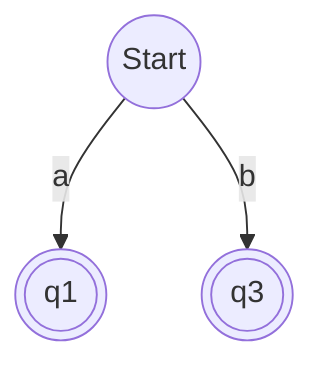

# regex_autofin_grareg

Proyecto del curso de Automatas

- Expresiones regulares

  a|b

- Automatas finitos

```mermaid
graph TD
   S0((Start));
   S0 --a--> S1(((q1)));
   S0 --b--> S3(((q3)));
```

- Gramatica Regular
